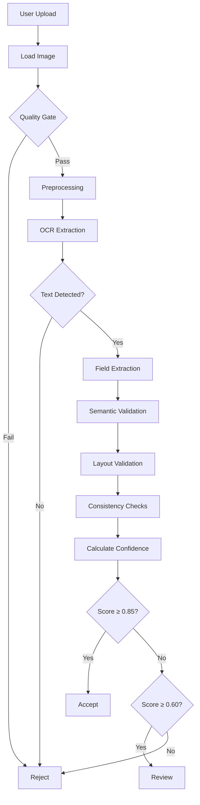

# OCR Pipeline Architecture

## Table of Contents

1. [System Overview](#system-overview)
2. [Design Principles](#design-principles)
3. [Validation Approaches](#validation-approaches)
4. [Component Details](#component-details)
5. [Data Flow](#data-flow)
6. [Confidence Scoring](#confidence-scoring)
7. [Decision Logic](#decision-logic)
8. [Scalability](#scalability)

---

## System Overview

This OCR pipeline is designed for **production environments** where:
- External API calls are prohibited
- Custom ML training is not feasible
- High volumes of noisy user uploads are expected
- False positives must be minimized
- Decisions must be explainable and auditable

### Core Philosophy

> **Robust OCR systems are not built by improving OCR alone — they are built by aggressively validating everything around it.**

The system uses **defensive layering**: each validation stage acts as an independent filter, and only documents passing all gates achieve high confidence scores.

---

## Design Principles

### 1. Deterministic Processing
- No randomness or probabilistic models
- Same input always produces same output
- Fully reproducible results

### 2. Fail-Fast Architecture
- Quality gate rejects garbage before expensive OCR
- Hard rejection rules prevent obvious failures
- Early exits save compute resources

### 3. Explainable Decisions
- Every score is traceable to specific metrics
- Decision reasons are human-readable
- No "black box" components

### 4. Configuration-Driven
- All thresholds externalized to YAML
- No hardcoded magic numbers
- Easy tuning without code changes

### 5. Production-Hardened
- Comprehensive error handling
- Structured logging at all stages
- Graceful degradation on failures

---

## Validation Approaches

### Approach 1: Image Quality Gate

**Purpose**: Reject garbage before OCR to save compute and reduce false positives.

**Metrics**:
- **Blur Score**: Laplacian variance (higher = sharper)
- **Brightness**: Mean pixel intensity [0, 255]
- **Resolution**: Total pixel count
- **Contrast Ratio**: Standard deviation / mean
- **Edge Density**: Ratio of edge pixels to total pixels

**Scoring**:
```
CompositeScore = w1·blur + w2·brightness + w3·resolution + w4·contrast
```

**Rejection Criteria**:
- Blur score < 100 (too blurry)
- Brightness < 30 or > 225 (too dark/bright)
- Contrast ratio < 1.5 (low contrast)
- Edge density < 0.01 (likely not a document)

**Strengths**:
- Very fast (pure CPU math)
- Prevents obvious garbage
- Reduces downstream load

**Limitations**:
- Good image ≠ valid document
- Cannot validate semantics

---

### Approach 2: OCR Engine Confidence

**Purpose**: Leverage Tesseract's word-level confidence scores.

**Implementation**:
- Extract confidence for each detected word
- Weight by token type:
  - Numeric tokens: 1.5× weight (important for invoices)
  - Alphabetic tokens: 1.0× weight
  - Stopwords: 0.3× weight (less important)

**Scoring**:
```
OCRScore = WeightedMean(word_confidences) / 100
```

**Rejection Criteria**:
- < 5 words detected
- > 40% words with confidence < 40
- No numeric tokens in invoice

**Strengths**:
- Directly reflects OCR reliability
- Easy to compute
- No additional processing needed

**Limitations**:
- Tesseract confidence can be misleading
- Good OCR ≠ valid document content

---

### Approach 3: Semantic Validation

**Purpose**: Validate extracted fields using deterministic rules.

**Field Validators**:

**Invoice Fields**:
- `invoice_number`: Regex `[A-Z0-9-]{6,20}`
- `date`: Valid date format, not in future
- `total_amount`: Numeric, > 0, < max_amount
- `vendor_name`: Non-empty string

**ID Document Fields**:
- `id_number`: Regex `[A-Z0-9]{8,15}`
- `name`: Capitalized name pattern
- `date_of_birth`: Valid date, in past
- `expiry_date`: Valid date, not too far expired

**Scoring**:
```
SemanticScore = Σ(valid_fields × field_weight) / Σ(field_weights)
```

**Field Weights** (Invoice):
- `total_amount`: 2.0 (most critical)
- `invoice_number`: 1.5
- `date`: 1.5
- `vendor_name`: 1.0

**Strengths**:
- Highly precise
- Deterministic
- No ML required
- Easy to debug

**Limitations**:
- Template dependent
- Fragile for diverse formats
- Requires good regex patterns

---

### Approach 4: Layout Validation

**Purpose**: Validate document structure using spatial anchors.

**Anchor System**:

**Invoice Anchors**:
- "invoice" keyword → top region
- "total" keyword → bottom region
- "date" keyword → top region

**ID Document Anchors**:
- "name" keyword → top region
- "date of birth" → center region
- Photo region → left side

**Region Matching**:
```python
# Normalize coordinates to [0, 1]
norm_x = x / width
norm_y = y / height

# Check region with tolerance
if region == 'top':
    matched = norm_y < tolerance
elif region == 'bottom':
    matched = norm_y > (1 - tolerance)
```

**Scoring**:
```
LayoutScore = matched_anchors / total_anchors
```

**Strengths**:
- Prevents random text documents from passing
- Effective for fixed-format IDs
- Spatial validation is robust

**Limitations**:
- Breaks for highly variable layouts
- Requires anchor tuning per document type

---

### Approach 5: Statistical Consistency

**Purpose**: Cross-field logic validation.

**Consistency Checks**:

**Invoice**:
- Arithmetic: `subtotal + tax ≈ total` (within 2% tolerance)
- Date logic: `invoice_date ≤ today + 30 days`
- Date ordering: `due_date ≥ invoice_date`

**ID Document**:
- Date logic: `date_of_birth < today`
- Expiry logic: `expiry_date > issue_date`
- Age range: `0 < age < 150`

**Scoring**:
```
ConsistencyScore = passed_checks / total_checks
```

**Strengths**:
- High precision
- Hard for garbage to satisfy
- Catches OCR errors

**Limitations**:
- Requires accurate OCR first
- Limited to numeric/date fields

---

### Approach 6: Multi-Stage Weighted Scoring

**Purpose**: Combine all validation layers into final decision.

**Weighted Formula**:
```
FinalScore = 
    0.20 × ImageQuality +
    0.25 × OCRConfidence +
    0.25 × SemanticScore +
    0.15 × LayoutScore +
    0.15 × ConsistencyScore
```

**Rationale for Weights**:
- **OCR & Semantic (50%)**: Core validation
- **Image Quality (20%)**: Foundation
- **Layout & Consistency (30%)**: Additional validation

**Decision Thresholds**:
- **Accept**: Score ≥ 0.85
- **Review**: 0.60 ≤ Score < 0.85
- **Reject**: Score < 0.60

**Strengths**:
- Robust to individual failures
- Reduces false positives
- Production-ready
- Tunable via config

---

## Component Details

### Image Quality Assessor

**File**: `src/quality/image_quality.py`

**Key Methods**:
- `calculate_blur_score()`: Laplacian variance
- `calculate_brightness_score()`: Mean intensity
- `calculate_contrast_score()`: Std/mean ratio
- `calculate_edge_density()`: Canny edge detection

**Normalization**:
- Blur: Capped at 1000, normalized to [0, 1]
- Brightness: Optimal at 127.5, penalize extremes
- Resolution: Good quality at 1920×1080
- Contrast: Excellent at > 0.5

---

### Preprocessing Pipeline

**File**: `src/preprocessing/corrections.py`

**Processing Order**:
1. **Noise Removal** (first, helps other algorithms)
   - Median blur for salt-and-pepper noise
   - Bilateral filter for edge-preserving smoothing

2. **Skew Correction**
   - Hough Line Transform to detect angles
   - Rotate using affine transform

3. **Perspective Correction**
   - Detect document edges via Canny
   - Find largest quadrilateral
   - Apply 4-point perspective transform

4. **Illumination Normalization**
   - CLAHE on L channel (LAB color space)
   - Adaptive thresholding for binarization

---

### OCR Engine

**File**: `src/ocr/engine.py`

**Tesseract Configuration**:
```
--oem 3    # LSTM OCR engine
--psm 3    # Automatic page segmentation
```

**Word-Level Extraction**:
```python
ocr_data = pytesseract.image_to_data(image, output_type=Output.DICT)
# Returns: text, conf, left, top, width, height, line_num, word_num
```

**Confidence Aggregation**:
- Ignore words with confidence < 0
- Weight numeric tokens higher
- Penalize high % of low-confidence words

---

### Document Processors

**Files**: `src/documents/invoice.py`, `src/documents/id_document.py`

**Responsibilities**:
- Field extraction (regex-based)
- Semantic validation
- Layout validation
- Consistency checking

**Extensibility**:
To add new document type:
1. Create `src/documents/new_type.py`
2. Inherit from `BaseDocumentProcessor`
3. Implement abstract methods
4. Add config section in `config.yaml`

---

## Data Flow



---

## Confidence Scoring

### Field-Level Confidence

For each extracted field:
```
FieldConfidence = 
    0.4 × OCR_word_confidence +
    0.4 × semantic_validity +
    0.2 × positional_validity
```

### Document-Level Confidence

Weighted average of critical fields:
```
DocumentConfidence = Σ(field_confidence × field_weight) / Σ(field_weights)
```

**Critical Fields** (higher weight):
- Invoice: `total_amount` (2.0), `invoice_number` (1.5)
- ID: `id_number` (2.0), `name` (1.8)

---

## Decision Logic

### Three-Tier System

| Tier | Score Range | Meaning | Action |
|------|-------------|---------|--------|
| 1 | ≥ 0.85 | High confidence | Auto-accept |
| 2 | 0.60-0.85 | Medium confidence | Manual review |
| 3 | < 0.60 | Low confidence | Auto-reject |

### Hard Rejection Rules

**Immediate rejection** if:
1. No text detected (`total_words == 0`)
2. Quality gate failed (`quality_passed == False`)
3. Mandatory fields missing
4. Excessive non-alphanumeric content (> 70%)

**Rationale**: These are unrecoverable failures that no amount of processing can fix.

---

## Scalability

### Parallel Processing

**Batch Mode**:
```python
results = pipeline.process_batch(
    image_paths,
    document_type='invoice',
    max_workers=4  # Configurable
)
```

**Implementation**:
- `ThreadPoolExecutor` for I/O-bound tasks
- Each worker processes independently
- No shared state between workers

### Performance Optimization

**Strategies**:
1. **Early exits**: Quality gate rejects before OCR
2. **Lazy evaluation**: Only compute needed metrics
3. **Caching**: Reuse preprocessed images if needed
4. **Batch size tuning**: Balance memory vs. throughput

**Typical Throughput**:
- Single-threaded: ~12-15 documents/minute
- 4 workers: ~45-60 documents/minute
- 8 workers: ~80-100 documents/minute (CPU-bound)

### Memory Management

**Per-Document Memory**:
- Image loading: ~5-20 MB (depends on resolution)
- OCR processing: ~50-100 MB
- Results: ~1-5 MB

**Batch Processing**:
- Use `max_workers` to limit concurrent memory
- Process in chunks for very large batches
- Clean up intermediate results

---

## Extension Points

### Adding New Document Types

1. **Create processor**:
```python
class NewDocProcessor(BaseDocumentProcessor):
    def extract_fields(self, ocr_result):
        # Custom extraction logic
        pass
```

2. **Add config section**:
```yaml
semantic:
  new_doc:
    required_fields: [...]
    patterns: {...}
```

3. **Register in pipeline**:
```python
self.new_processor = NewDocProcessor(self.config)
```

### Custom Validation Rules

Add to `src/validation/semantic.py`:
```python
def _validate_custom_field(self, field_name, value):
    # Custom validation logic
    return ValidationResult(...)
```

### Tuning Weights

Modify `config.yaml`:
```yaml
scoring:
  weights:
    image_quality: 0.15  # Reduce if images are always good
    semantic_validity: 0.35  # Increase for strict validation
```

---

## Production Considerations

### Monitoring

**Key Metrics to Track**:
- Decision distribution (accept/review/reject ratios)
- Average confidence scores
- Processing time per document
- Quality gate failure rate
- OCR confidence distribution

### Logging

**Log Levels**:
- `DEBUG`: Detailed stage-by-stage processing
- `INFO`: Document-level decisions
- `WARNING`: Quality gate failures, low confidence
- `ERROR`: Processing exceptions

### Error Handling

**Graceful Degradation**:
- Image load failure → Return error result
- OCR failure → Try with different preprocessing
- Validation error → Log and continue with partial data

---

## Audit Trail

Every decision includes:
- All confidence scores
- Specific reasons for decision
- Extracted fields with confidences
- Quality metrics
- Processing timestamps

**Example Audit Log**:
```json
{
  "timestamp": "2024-01-15T10:30:00Z",
  "document": "invoice_001.jpg",
  "decision": "accept",
  "final_score": 0.91,
  "reasons": [
    "Confidence score 0.91 exceeds accept threshold 0.85",
    "High image quality (0.87)",
    "Strong semantic validation (0.95)"
  ],
  "extracted_fields": {...},
  "processing_time": 3.2
}
```

---

## Conclusion

This architecture prioritizes:
- **Reliability** over speed
- **Explainability** over complexity
- **Determinism** over flexibility
- **Production-readiness** over research novelty

The multi-layered validation approach ensures that only high-quality, valid documents achieve acceptance, making the system suitable for production environments where false positives are costly.
